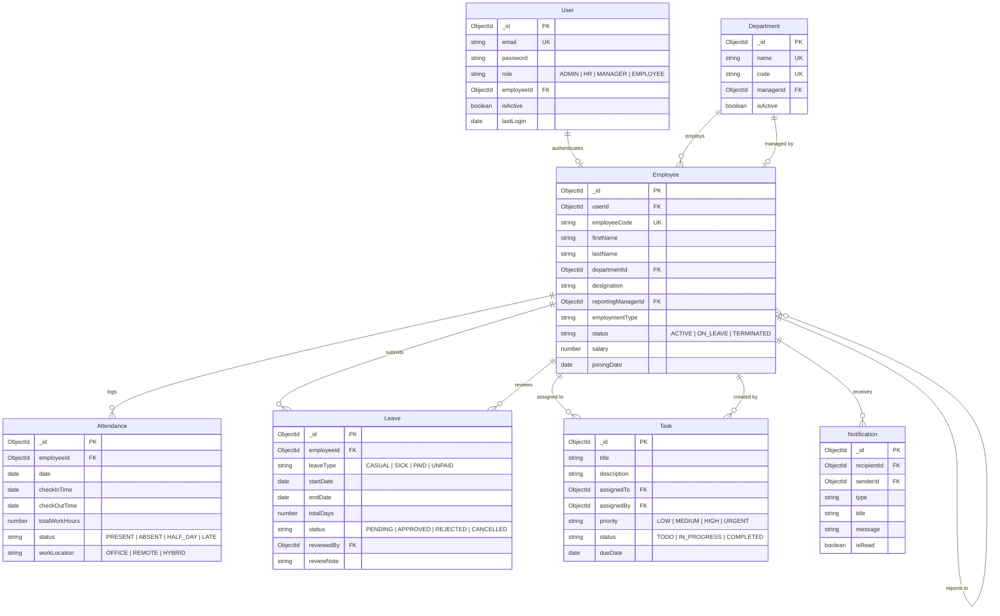
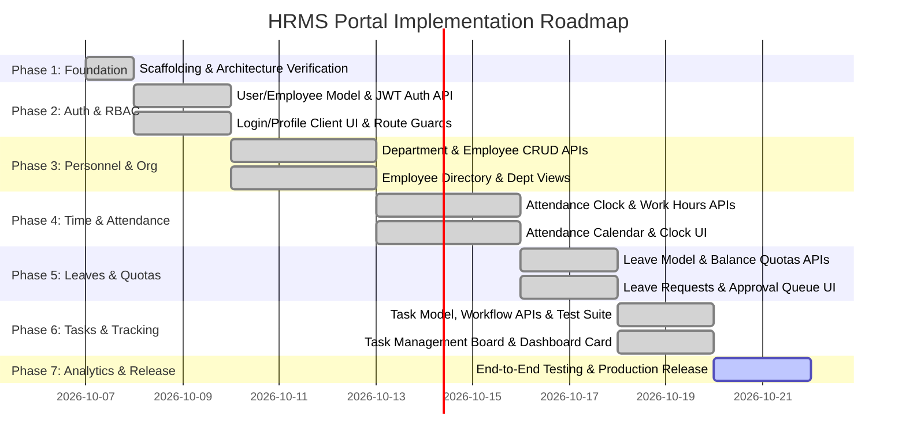

# HRMS Portal — System Architecture & Specification Document

> **Document Version**: 1.0.0  
> **Target Audience**: Core Engineering Team (Developer 1: Frontend, Developer 2: Backend)  
> **Status**: Approved Foundation — Ready for Domain Implementation

---

## 1. System Overview

The **HRMS Portal** is an enterprise-grade Human Resource Management System engineered as a decoupled, full-stack web application. It provides an organizational management suite covering employee records, department structures, attendance logging, leave approval workflows, task delegation, and role-tailored analytical dashboards.

### Core Architectural Goals
1. **Separation of Concerns**: Complete decoupling of presentation logic (`frontend/`) and API/business logic (`backend/`).
2. **Type-Consistent Modern JavaScript**: Pure ES Modules (`import`/`export`) across both client and server runtimes on Node.js v24.
3. **Stateless Security**: Token-based authentication using JSON Web Tokens (JWT) and salted password hashing with `bcryptjs`.
4. **Resilient Data Persistence**: Structured document modeling using MongoDB with Mongoose schemas, compound indexes, and graceful reconnection lifecycles.
5. **Team Collaboration Ready**: Strict branch isolation (`main`, `frontend`, `backend`) to allow independent simultaneous development without merge conflicts.

---

## 2. Team Ownership & Collaboration Strategy

### 2.1 Developer Ownership Matrix

| Area | Developer 1 (Frontend Lead) | Developer 2 (Backend Lead) |
| :--- | :--- | :--- |
| **Core Scope** | React 19, Vite, Tailwind CSS v4, React Router, Context API, Lucide React, Recharts | Node.js, Express.js, MongoDB/Mongoose, JWT, bcryptjs, REST APIs |
| **Responsibilities** | - UI component architecture (`components/common`, `components/layout`)<br>- Pages and route management<br>- State management via Context API<br>- Axios API integration and client error handling<br>- Responsive and accessible design | - Express server architecture (`controllers`, `services`, `middleware`)<br>- Mongoose model schemas, validations, and indexes<br>- Authentication and RBAC authorization guards<br>- Data validation and sanitized error responses<br>- Database migrations and seeding |
| **Shared Boundary** | API Contract (`docs/ARCHITECTURE.md`) & Root Configuration (`.env.example`, `.gitignore`) |

### 2.2 Git Branching Model

```text
main (Production/Stable Release branch only — locked from direct commits)
  │
  ├── frontend (Developer 1 working branch for React UI, routing, and client state)
  │
  └── backend  (Developer 2 working branch for Express APIs, Mongoose models, and auth)
```

#### Collaboration Rules
1. **No Direct Commits to `main`**: All feature work occurs on `frontend` or `backend` (or dedicated feature branches like `feat/auth-api`, `feat/attendance-ui`).
2. **Integration via Pull Requests / Merges**: Merging into `main` requires both developers to verify that frontend builds cleanly (`npm run build`) and backend tests pass.
3. **Shared Architecture Coordination**: Any alteration to database schemas, API routes, or environment variables requires mutual agreement and an update to `docs/ARCHITECTURE.md`.
4. **Environment Secret Protection**: Never commit `.env` or `.env.local` files. All new environment variables must be documented in `.env.example` with sanitized placeholder values.

---

## 3. Database Architecture & Relationships

### 3.1 Entity Relationship Diagram



---

### 3.2 Model Schemas Specification

#### 1. User Model
* **Collection**: `users`
* **Purpose**: System credentials, authentication status, and high-level role authorization.
* **Fields**:
  * `email` (String, required, unique, lowercase, trim): User email address.
  * `password` (String, required, min 8 chars): bcrypt-hashed password (excluded from JSON outputs).
  * `role` (String, required, enum: `['ADMIN', 'HR', 'MANAGER', 'EMPLOYEE']`, default: `'EMPLOYEE'`).
  * `employeeId` (ObjectId, ref: `'Employee'`, optional): Reference to employee profile.
  * `isActive` (Boolean, default: `true`): Account active/inactive status flag.
  * `lastLogin` (Date, optional): Timestamp of latest successful authentication.
  * `passwordResetToken` (String, optional): Hashed reset token.
  * `passwordResetExpires` (Date, optional): Expiration time for reset token.
  * `timestamps` (Boolean, default: `true`): `createdAt`, `updatedAt`.
* **Indexes**:
  * `{ email: 1 }` (unique)
  * `{ role: 1 }`
  * `{ employeeId: 1 }`

#### 2. Department Model
* **Collection**: `departments`
* **Purpose**: Organizational units, cost centers, and departmental hierarchies.
* **Fields**:
  * `name` (String, required, unique, trim): e.g., 'Engineering', 'Human Resources'.
  * `code` (String, required, unique, uppercase, trim): e.g., 'ENG', 'HRM', 'FIN'.
  * `description` (String, optional, trim): Summary of departmental scope.
  * `managerId` (ObjectId, ref: `'Employee'`, optional): Department head / director.
  * `isActive` (Boolean, default: `true`): Status flag for active department operations.
  * `timestamps` (Boolean, default: `true`).
* **Indexes**:
  * `{ code: 1 }` (unique)
  * `{ name: 1 }` (unique)
  * `{ managerId: 1 }`

#### 3. Employee Model
* **Collection**: `employees`
* **Purpose**: Detailed personnel profile, employment terms, department allocation, and manager link.
* **Fields**:
  * `userId` (ObjectId, ref: `'User'`, required, unique): Account credentials link.
  * `employeeCode` (String, required, unique, uppercase, trim): e.g., 'EMP-1001'.
  * `firstName` (String, required, trim): First name.
  * `lastName` (String, required, trim): Last name.
  * `phone` (String, optional, trim): Contact phone number.
  * `dateOfBirth` (Date, optional): Employee birth date.
  * `gender` (String, enum: `['MALE', 'FEMALE', 'OTHER', 'PREFER_NOT_TO_SAY']`, optional).
  * `address` (Object, optional):
    * `street`, `city`, `state`, `postalCode`, `country` (Strings).
  * `departmentId` (ObjectId, ref: `'Department'`, required): Assigned department.
  * `designation` (String, required, trim): e.g., 'Senior Frontend Engineer'.
  * `joiningDate` (Date, required): Date of company induction.
  * `employmentType` (String, enum: `['FULL_TIME', 'PART_TIME', 'CONTRACT', 'INTERN']`, default: `'FULL_TIME'`).
  * `status` (String, enum: `['ACTIVE', 'ON_LEAVE', 'PROBATION', 'TERMINATED', 'RESIGNED']`, default: `'ACTIVE'`).
  * `reportingManagerId` (ObjectId, ref: `'Employee'`, optional): Manager in organizational tree.
  * `salary` (Number, optional): Monthly or annual compensation (secured via RBAC).
  * `emergencyContact` (Object, optional):
    * `name`, `relationship`, `phone` (Strings).
  * `timestamps` (Boolean, default: `true`).
* **Indexes**:
  * `{ employeeCode: 1 }` (unique)
  * `{ userId: 1 }` (unique)
  * `{ departmentId: 1 }`
  * `{ reportingManagerId: 1 }`
  * `{ status: 1 }`

#### 4. Attendance Model
* **Collection**: `attendances`
* **Purpose**: Daily work presence tracking, punch timestamps, and server-side work hours calculation.
* **Fields**:
  * `employee` (ObjectId, ref: `'Employee'`, required): Record owner.
  * `date` (Date, required): Date normalized to UTC midnight (e.g. `YYYY-MM-DDT00:00:00.000Z`).
  * `checkIn` (Date, optional): Check-in punch timestamp.
  * `checkOut` (Date, optional): Check-out punch timestamp.
  * `workHours` (Number, default: 0): Server-calculated duration in hours (`(checkOut - checkIn) / 3600000`, rounded to 2 decimals).
  * `status` (String, enum: `['PRESENT', 'ABSENT', 'HALF_DAY', 'ON_LEAVE', 'WEEKEND', 'HOLIDAY']`, default: `'PRESENT'`). Automatically flags `HALF_DAY` if duration is `< 4.5` hours.
  * `remarks` (String, optional, trim): Explanatory note or punch exception.
  * `timestamps` (Boolean, default: `true`).
* **Indexes**:
  * `{ employee: 1, date: 1 }` (unique compound index: strictly one attendance document per employee per day)
  * `{ date: 1 }`
  * `{ status: 1 }`

#### 5. Leave Model
* **Collection**: `leaves`
* **Purpose**: Time-off booking, quota consumption, hierarchical approval tracking, and attendance integration.
* **Fields**:
  * `employee` (ObjectId, ref: `'Employee'`, required): Requesting employee.
  * `leaveType` (String, enum: `['CASUAL', 'SICK', 'EARNED', 'UNPAID', 'OTHER']`, required).
  * `startDate` (Date, required): First day of requested leave normalized to UTC midnight.
  * `endDate` (Date, required): Final day of requested leave normalized to UTC midnight.
  * `numberOfDays` (Number, required, computed server-side): Inclusive working/calendar duration in days.
  * `reason` (String, required, trim, maxlength 500): Explanation for time-off request.
  * `status` (String, enum: `['PENDING', 'APPROVED', 'REJECTED', 'CANCELLED']`, default: `'PENDING'`).
  * `appliedAt` (Date, default: `Date.now`).
  * `reviewedAt` (Date, optional): Review decision timestamp.
  * `reviewedBy` (ObjectId, ref: `'Employee'`, optional): Reviewing Manager, HR, or Admin.
  * `reviewerComment` (String, optional, trim, maxlength 500): Reviewer notes or rejection justification.
  * `timestamps` (Boolean, default: `true`).
* **Indexes**:
  * `{ employee: 1, status: 1 }`
  * `{ startDate: 1, endDate: 1 }`
  * `{ employee: 1, startDate: 1, endDate: 1 }`
  * `{ status: 1 }`

#### 6. Task Model
* **Collection**: `tasks`
* **Purpose**: Task delegation, project deliverables, deadline scheduling, priority governance, and progress tracking.
* **Fields**:
  * `title` (String, required, trim, maxlength: 200): Task title.
  * `description` (String, trim, maxlength: 2000): Detailed task scope and requirements.
  * `assignedTo` (ObjectId, ref: `'Employee'`, required, indexed): Responsible employee.
  * `assignedBy` (ObjectId, ref: `'User'`, required, indexed): Authenticated author who delegated the task.
  * `department` (ObjectId, ref: `'Department'`, required, indexed): Target department context.
  * `priority` (String, enum: `['LOW', 'MEDIUM', 'HIGH', 'URGENT']`, default: `'MEDIUM'`, indexed).
  * `status` (String, enum: `['TODO', 'IN_PROGRESS', 'REVIEW', 'COMPLETED', 'CANCELLED']`, default: `'TODO'`, indexed).
  * `dueDate` (Date, required, indexed): Deliverable deadline.
  * `estimatedHours` (Number, default: 0, min: 0): Estimated workload.
  * `completedAt` (Date, default: `null`): Automatically set when status moves to `COMPLETED`; cleared upon reopening.
  * `timestamps` (Boolean, default: `true`).
* **Virtual Fields**:
  * `isOverdue` (Boolean): Dynamically evaluated as `dueDate < Date.now()` when status is neither `COMPLETED` nor `CANCELLED`.
* **Compound Indexes**:
  * `{ assignedTo: 1, status: 1 }`
  * `{ department: 1, status: 1 }`
  * `{ assignedTo: 1, dueDate: 1 }`
  * `{ department: 1, dueDate: 1 }`

#### 7. Notification Model
* **Collection**: `notifications`
* **Purpose**: In-app notifications for workflow events (leave requests, approvals, task updates).
* **Fields**:
  * `recipientId` (ObjectId, ref: `'Employee'`, required): Targeted recipient.
  * `senderId` (ObjectId, ref: `'Employee'`, optional): Event trigger author.
  * `type` (String, enum: `['LEAVE_REQUEST', 'LEAVE_STATUS', 'TASK_ASSIGNED', 'TASK_UPDATED', 'ATTENDANCE_ALERT', 'ANNOUNCEMENT']`, required).
  * `title` (String, required): Alert title.
  * `message` (String, required): Alert message body.
  * `link` (String, optional): Client application route (e.g., `'/leaves'` or `'/tasks'`).
  * `isRead` (Boolean, default: `false`).
  * `readAt` (Date, optional): Read timestamp.
  * `timestamps` (Boolean, default: `true`).
* **Indexes**:
  * `{ recipientId: 1, isRead: 1, createdAt: -1 }`

---

## 4. Role-Based Access Control (RBAC) Permission Matrix

The application supports four hierarchical and functional roles:

1. **`ADMIN`**: Complete system governance, role provisioning, organization setup, and administrative overrides.
2. **`HR`**: Human resources management, company-wide employee directory, leave and attendance governance, and company reports.
3. **`MANAGER`**: Team leadership, direct-report monitoring, leave approval pipeline, and task delegation.
4. **`EMPLOYEE`**: Self-service portal for personal attendance, leave applications, task tracking, and personal profile.

| Functional Area | Action | ADMIN | HR | MANAGER | EMPLOYEE |
| :--- | :--- | :---: | :---: | :---: | :---: |
| **Authentication & Users** | Login & Self Password Reset | ✅ | ✅ | ✅ | ✅ |
| | Create User Accounts & Assign Roles | ✅ | ✅ (Staff) | ❌ | ❌ |
| | Manage System Security Settings | ✅ | ❌ | ❌ | ❌ |
| **Employee Directory** | View Public Directory (Name, Dept, Role) | ✅ | ✅ | ✅ | ✅ |
| | View Full Details (Salary, Emergency, Contract) | ✅ | ✅ | Team Only (No Salary) | Own Profile Only |
| | Create / Onboard New Employee | ✅ | ✅ | ❌ | ❌ |
| | Edit Employee Profile | ✅ | ✅ | ❌ | Own (Contact Only) |
| | Terminate / Deactivate Employee | ✅ | ✅ | ❌ | ❌ |
| **Department Management** | View Departments | ✅ | ✅ | ✅ | ✅ |
| | Create / Update Department Details | ✅ | ✅ | ❌ | ❌ |
| | Delete Department | ✅ | ❌ | ❌ | ❌ |
| **Attendance** | Check-in / Check-out (Self) | ✅ | ✅ | ✅ | ✅ |
| | View Attendance History | All Org | All Org | Direct Reports + Self | Own Records Only |
| | Manual Attendance Entry / Modification | ✅ | ✅ | ✅ (Direct Reports) | ❌ |
| | Delete Attendance Record | ✅ | ❌ | ❌ | ❌ |
| **Leave Management** | Submit Leave Request | ✅ | ✅ | ✅ | ✅ |
| | View Leave Balance & History | All | All | Team Reports | Own Records |
| | Approve / Reject Leave Request | ✅ (All) | ✅ (All) | ✅ (Team Reports) | ❌ |
| | Cancel Own Pending Leave | ✅ | ✅ | ✅ | ✅ |
| **Task Management** | Create / Assign Tasks | To Anyone | To Anyone | To Team Members | ❌ |
| | View Assigned Tasks | All | All | Team Tasks | Own Tasks |
| | Update Task Status | Any | Any | Team Tasks | Assigned Tasks |
| **Dashboards & Reports** | Executive Organization Metrics | ✅ | ✅ | ❌ | ❌ |
| | Team Productivity & Attendance Overview | ✅ | ✅ | ✅ (Team Scope) | ❌ |
| | Personal Dashboard Hub | ✅ | ✅ | ✅ | ✅ |

---

## 5. REST API Specifications & Contracts

### 5.1 Global API Standards

* **Base URL**: `http://localhost:5001/api`
* **Content Negotiation**: `Content-Type: application/json`
* **Standard Success Envelope**:
  ```json
  {
    "success": true,
    "message": "Operation completed successfully",
    "data": { ... }
  }
  ```
* **Standard Error Envelope**:
  ```json
  {
    "success": false,
    "message": "Detailed error explanation",
    "errors": [ ... ]
  }
  ```
* **Authentication Header**: `Authorization: Bearer <jwt_token>`

---

### 5.2 API Endpoints Matrix

#### 1. Authentication (`/api/auth`)

| Method | Endpoint | Purpose | Auth | Roles | Request Body | Success Response | Error Responses |
| :--- | :--- | :--- | :--- | :--- | :--- | :--- | :--- |
| `POST` | `/auth/login` | Authenticate user & issue JWT | Public | Anyone | `{ email, password }` | `200 OK`: `{ token, user: { id, email, role, employeeId } }` | `400 Bad Request`<br>`401 Unauthorized` |
| `GET` | `/auth/me` | Fetch active user session | Required | All | None | `200 OK`: `{ user, employeeProfile }` | `401 Unauthorized`<br>`404 Not Found` |
| `POST` | `/auth/register` | Initial system setup or admin creation | Required (or Public on initial bootstrap) | ADMIN, HR | `{ email, password, role, employeeCode, firstName, lastName, departmentId }` | `201 Created`: `{ user, employee }` | `400 Validation Error`<br>`409 Email/Code Exists` |

#### 2. Employees (`/api/employees`)

| Method | Endpoint | Purpose | Auth | Roles | Request Body | Success Response | Error Responses |
| :--- | :--- | :--- | :--- | :--- | :--- | :--- | :--- |
| `GET` | `/employees` | List employees with filters & pagination | Required | All (salary hidden for non-Admin/HR) | Query: `?page=1&limit=10&search=&department=&status=` | `200 OK`: `{ data: { employees, total, pages } }` | `401 Unauthorized` |
| `POST` | `/employees` | Create employee and linked user account | Required | ADMIN, HR | `{ firstName, lastName, email, role, departmentId, designation, ... }` | `201 Created`: `{ data: employee }` | `400 Bad Request`<br>`409 Email Exists` |
| `GET` | `/employees/:id` | Get employee details by ID | Required | All (salary hidden for non-Admin/HR) | None | `200 OK`: `{ data: employee }` | `404 Not Found` |
| `PUT` | `/employees/:id` | Update employee information | Required | ADMIN, HR | Updated employee fields | `200 OK`: `{ data: employee }` | `400 Bad Request`<br>`404 Not Found` |
| `DELETE` | `/employees/:id` | Soft delete / deactivate employee | Required | ADMIN | None | `200 OK`: `{ message: 'Employee deactivated' }` | `403 Forbidden`<br>`404 Not Found` |

#### 3. Departments (`/api/departments`)

| Method | Endpoint | Purpose | Auth | Roles | Request Body | Success Response | Error Responses |
| :--- | :--- | :--- | :--- | :--- | :--- | :--- | :--- |
| `GET` | `/departments` | List all departments with member count | Required | All | Query: `?status=ACTIVE` | `200 OK`: `{ data: [...] }` | `401 Unauthorized` |
| `POST` | `/departments` | Create new organizational department | Required | ADMIN, HR | `{ name, code, description, managerId }` | `201 Created`: `{ data: department }` | `400 Bad Request`<br>`409 Code Exists` |
| `GET` | `/departments/:id` | Get department details and member list | Required | All | None | `200 OK`: `{ data: department }` | `404 Not Found` |
| `PUT` | `/departments/:id` | Update department details / manager | Required | ADMIN, HR | `{ name, description, managerId, isActive }` | `200 OK`: `{ data: department }` | `400 Bad Request`<br>`404 Not Found` |
| `DELETE` | `/departments/:id` | Deactivate/remove department safely | Required | ADMIN | None | `200 OK`: `{ message: 'Department deactivated' }` | `400 Has Active Members`<br>`403 Forbidden` |

#### 4. Attendance (`/api/attendance`)

| Method | Endpoint | Purpose | Auth | Roles | Request Body / Query | Success Response | Error Responses |
| :--- | :--- | :--- | :--- | :--- | :--- | :--- | :--- |
| `POST` | `/attendance/check-in` | Punch-in for current workday | Required | All Active Employees | `{ remarks? }` | `200 OK`: `{ message, data: attendance }` | `400 Already Checked In`<br>`400 Inactive Profile` |
| `POST` | `/attendance/check-out` | Punch-out & calculate work hours | Required | All Active Employees | `{ remarks? }` | `200 OK`: `{ message, data: attendance }` | `400 No Active Check-In`<br>`400 Already Checked Out` |
| `GET` | `/attendance/my` | Personal attendance history & today status | Required | All | Query: `?month=10&year=2026` | `200 OK`: `{ data: { todayRecord, records, stats } }` | `401 Unauthorized` |
| `GET` | `/attendance/summary` | Today's headcount & attendance summary | Required | All | Query: `?date=2026-10-07&department=` | `200 OK`: `{ data: { totalEmployees, present, halfDay, ... } }` | `401 Unauthorized` |
| `GET` | `/attendance/employee/:employeeId` | Specific employee attendance history | Required | ADMIN, HR, MANAGER | None | `200 OK`: `{ data: [...] }` | `403 Forbidden`<br>`404 Not Found` |
| `GET` | `/attendance` | Paginated listing with multi-parameter filter | Required | All (scoped by RBAC) | Query: `?startDate=&endDate=&department=&status=&page=` | `200 OK`: `{ data: { records, total, page, pages } }` | `401 Unauthorized` |
| `GET` | `/attendance/:id` | Get attendance entry by ID | Required | All (scoped by RBAC) | None | `200 OK`: `{ data: record }` | `403 Forbidden`<br>`404 Not Found` |
| `POST` | `/attendance` | Manual attendance logging | Required | ADMIN, HR, MANAGER (direct reports) | `{ employeeId, date, checkIn, checkOut, status, remarks }` | `201 Created`: `{ message, data: attendance }` | `400 Bad Request`<br>`409 Duplicate Record` |
| `PUT` | `/attendance/:id` | Update attendance entry | Required | ADMIN, HR, MANAGER (direct reports) | `{ checkIn, checkOut, status, remarks }` | `200 OK`: `{ message, data: attendance }` | `400 Bad Request`<br>`403 Forbidden` |
| `DELETE` | `/attendance/:id` | Remove attendance entry | Required | ADMIN | None | `200 OK`: `{ message: 'Attendance record deleted' }` | `403 Forbidden`<br>`404 Not Found` |
| `POST` | `/auth/change-password` | Update account password | Required | All | `{ currentPassword, newPassword }` | `200 OK`: `{ message: 'Password updated' }` | `400 Weak Password`<br>`401 Invalid Current` |

#### 2. Employees (`/api/employees`)

| Method | Endpoint | Purpose | Auth | Roles | Request Body | Success Response | Error Responses |
| :--- | :--- | :--- | :--- | :--- | :--- | :--- | :--- |
| `GET` | `/employees` | List employees (paginated, filtered) | Required | All (scoped) | Query: `?page=1&limit=10&department=&status=&search=` | `200 OK`: `{ employees: [...], total, page, pages }` | `401 Unauthorized`<br>`403 Forbidden` |
| `POST` | `/employees` | Create employee profile & credentials | Required | ADMIN, HR | `{ firstName, lastName, email, departmentId, designation, joiningDate, employmentType, salary, reportingManagerId }` | `201 Created`: `{ employee }` | `400 Bad Request`<br>`409 Duplicate Employee` |
| `GET` | `/employees/:id` | Get employee details by ID | Required | All (scoped) | None | `200 OK`: `{ employee }` | `401 Unauthorized`<br>`404 Not Found` |
| `PUT` | `/employees/:id` | Update employee information | Required | ADMIN, HR (Full), EMPLOYEE (Contact only) | Partial employee payload | `200 OK`: `{ employee }` | `400 Bad Request`<br>`403 Forbidden` |
| `DELETE` | `/employees/:id` | Soft-delete / Terminate employee | Required | ADMIN | None | `200 OK`: `{ message: 'Employee deactivated' }` | `403 Forbidden`<br>`404 Not Found` |

#### 3. Departments (`/api/departments`)

| Method | Endpoint | Purpose | Auth | Roles | Request Body | Success Response | Error Responses |
| :--- | :--- | :--- | :--- | :--- | :--- | :--- | :--- |
| `GET` | `/departments` | List all departments with member counts | Required | All | None | `200 OK`: `{ departments: [...] }` | `401 Unauthorized` |
| `POST` | `/departments` | Create new department | Required | ADMIN, HR | `{ name, code, description, managerId }` | `201 Created`: `{ department }` | `400 Bad Request`<br>`409 Code Exists` |
| `GET` | `/departments/:id` | Get department details & member list | Required | All | None | `200 OK`: `{ department, members: [...] }` | `404 Not Found` |
| `PUT` | `/departments/:id` | Update department details / manager | Required | ADMIN, HR | `{ name, description, managerId, isActive }` | `200 OK`: `{ department }` | `400 Bad Request`<br>`404 Not Found` |
| `DELETE` | `/departments/:id` | Deactivate/remove department | Required | ADMIN | None | `200 OK`: `{ message: 'Department removed' }` | `400 Has Active Members`<br>`403 Forbidden` |

#### 4. Attendance (`/api/attendance`)

| Method | Endpoint | Purpose | Auth | Roles | Request Body | Success Response | Error Responses |
| :--- | :--- | :--- | :--- | :--- | :--- | :--- | :--- |
| `POST` | `/attendance/check-in` | Punch-in for current workday | Required | All | `{ workLocation: 'OFFICE' | 'REMOTE' }` | `201 Created`: `{ attendance }` | `400 Already Checked In` |
| `POST` | `/attendance/check-out` | Punch-out & calculate work hours | Required | All | `{ notes }` | `200 OK`: `{ attendance, totalWorkHours }` | `400 No Active Check-In` |
| `GET` | `/attendance/my-attendance`| Get logged user's monthly attendance | Required | All | Query: `?month=10&year=2026` | `200 OK`: `{ records: [...], summary }` | `401 Unauthorized` |
| `GET` | `/attendance` | Company / Team attendance records | Required | ADMIN, HR, MANAGER | Query: `?date=2026-10-07&department=&employeeId=` | `200 OK`: `{ records: [...] }` | `403 Forbidden` |
| `PUT` | `/attendance/:id` | Admin/HR manual attendance correction | Required | ADMIN, HR | `{ checkInTime, checkOutTime, status, notes }` | `200 OK`: `{ attendance }` | `400 Bad Request`<br>`404 Not Found` |

#### 5. Leave (`/api/leaves`)

| Method | Endpoint | Purpose | Auth | Roles | Request Body / Query | Success Response | Error Responses |
| :--- | :--- | :--- | :--- | :--- | :--- | :--- | :--- |
| `POST` | `/leaves` | Apply for time-off | Required | All Active Employees | `{ leaveType, startDate, endDate, reason }` | `201 Created`: `{ message, data: leave }` | `400 Insufficient Balance`<br>`400 Overlapping Leave`<br>`400 Inactive Employee` |
| `GET` | `/leaves/my` | View personal leave requests & stats | Required | All | Query: `?status=&leaveType=&year=&page=&limit=` | `200 OK`: `{ data: { leaves, stats, balances } }` | `401 Unauthorized` |
| `GET` | `/leaves/balance` | View logged-in user leave quotas | Required | All | None | `200 OK`: `{ data: { balances, used } }` | `401 Unauthorized` |
| `GET` | `/leaves/balance/:employeeId` | View specific employee quotas | Required | ADMIN, HR, MANAGER (direct reports) | None | `200 OK`: `{ data: { balances, used } }` | `403 Forbidden`<br>`404 Not Found` |
| `GET` | `/leaves` | Multi-filter team & org leave requests | Required | All (scoped by RBAC) | Query: `?status=&leaveType=&department=&startDate=&endDate=` | `200 OK`: `{ data: { leaves, total, pages } }` | `401 Unauthorized` |
| `GET` | `/leaves/:id` | View specific leave details | Required | Owner, Manager, HR, Admin | None | `200 OK`: `{ data: leave }` | `403 Forbidden`<br>`404 Not Found` |
| `PUT` | `/leaves/:id` | Edit pending leave request | Required | Owner (while PENDING) or Admin/HR | `{ leaveType?, startDate?, endDate?, reason? }` | `200 OK`: `{ message, data: leave }` | `400 Non-Pending Status`<br>`403 Forbidden` |
| `PATCH` | `/leaves/:id/approve` | Approve request, deduct balance & sync attendance | Required | ADMIN, HR, MANAGER (direct reports) | `{ reviewerComment? }` | `200 OK`: `{ message, data: leave }` | `400 Insufficient Balance`<br>`400 Duplicate Approval`<br>`403 Forbidden` |
| `PATCH` | `/leaves/:id/reject` | Reject request & restore balance if needed | Required | ADMIN, HR, MANAGER (direct reports) | `{ reviewerComment? }` | `200 OK`: `{ message, data: leave }` | `400 Already Processed`<br>`403 Forbidden` |
| `POST` | `/leaves/:id/cancel` | Cancel request & restore quota if approved | Required | Owner, HR, Admin | None | `200 OK`: `{ message, data: leave }` | `400 Already Cancelled`<br>`400 Already Rejected` |
| `DELETE` | `/leaves/:id` | Delete leave request | Required | ADMIN (or Owner if PENDING) | None | `200 OK`: `{ message: 'Leave record deleted' }` | `403 Forbidden`<br>`404 Not Found` |

#### 6. Tasks (`/api/tasks`)

| Method | Endpoint | Purpose | Auth | Roles | Request Body | Success Response | Error Responses |
| :--- | :--- | :--- | :--- | :--- | :--- | :--- | :--- |
| `POST` | `/tasks` | Create and assign a task | Required | ADMIN, HR, MANAGER | `{ title, description?, department, assignedTo, priority?, dueDate, estimatedHours? }` | `201 Created`: `{ task }` | `400 Validation Error`<br>`400 Inactive Employee/Dept`<br>`403 Forbidden` |
| `GET` | `/tasks/my` | Get current employee's tasks & stats | Required | Authenticated Employee | Query: `?status=&priority=&overdue=` | `200 OK`: `{ tasks: [...], stats }` | `401 Unauthorized` |
| `GET` | `/tasks` | List company/team tasks with multi-filter | Required | Scoped (ADMIN, HR, MANAGER, EMPLOYEE) | Query: `?status=&priority=&department=&assignedTo=&overdue=&search=&page=&limit=` | `200 OK`: `{ tasks: [...], total, pages, stats }` | `403 Forbidden` |
| `GET` | `/tasks/:id` | View single task details | Required | Scoped by Role | None | `200 OK`: `{ task }` | `403 Forbidden`<br>`404 Not Found` |
| `PUT` | `/tasks/:id` | Update task fields (title, priority, due date, etc.) | Required | ADMIN, HR, MANAGER | `{ title?, description?, department?, assignedTo?, priority?, dueDate?, estimatedHours? }` | `200 OK`: `{ message, data: task }` | `400 Invalid Date/Dept`<br>`403 Forbidden` |
| `PATCH` | `/tasks/:id/status` | Advance or reopen task status | Required | Assignee, MANAGER, HR, ADMIN | `{ status: 'TODO' \| 'IN_PROGRESS' \| 'REVIEW' \| 'COMPLETED' \| 'CANCELLED' }` | `200 OK`: `{ message, data: task }` | `400 Invalid Status`<br>`403 Forbidden` |
| `PATCH` | `/tasks/:id/assign` | Reassign task to a different employee | Required | ADMIN, HR, MANAGER | `{ assignedTo, department? }` | `200 OK`: `{ message, data: task }` | `400 Inactive / Mismatched`<br>`403 Forbidden` |
| `DELETE` | `/tasks/:id` | Permanently remove task | Required | ADMIN, HR, Task Creator MANAGER | None | `200 OK`: `{ message: 'Task deleted successfully' }` | `403 Forbidden`<br>`404 Not Found` |

#### 7. Dashboard (`/api/dashboard`)

| Method | Endpoint | Purpose | Auth | Roles | Request Body | Success Response | Error Responses |
| :--- | :--- | :--- | :--- | :--- | :--- | :--- | :--- |
| `GET` | `/dashboard/stats` | Org-level metrics and trends | Required | ADMIN, HR | None | `200 OK`: `{ totalEmployees, activeCount, onLeaveToday, attendanceRate, deptBreakdown }` | `403 Forbidden` |
| `GET` | `/dashboard/manager`| Team-specific metrics and alerts | Required | MANAGER | None | `200 OK`: `{ teamSize, teamPresent, pendingLeaveApprovals, activeTasks }` | `403 Forbidden` |
| `GET` | `/dashboard/employee`| Employee self-service status card | Required | All | None | `200 OK`: `{ todayStatus, pendingLeaves, assignedTasksCount, recentAnnouncements }` | `401 Unauthorized` |

#### 8. Notifications (`/api/notifications`)

| Method | Endpoint | Purpose | Auth | Roles | Request Body | Success Response | Error Responses |
| :--- | :--- | :--- | :--- | :--- | :--- | :--- | :--- |
| `GET` | `/notifications` | Retrieve unread/recent notifications | Required | All | Query: `?limit=20` | `200 OK`: `{ notifications: [...], unreadCount }` | `401 Unauthorized` |
| `PATCH` | `/notifications/:id/read` | Mark single notification as read | Required | All (owner) | None | `200 OK`: `{ notification }` | `404 Not Found` |
| `PATCH` | `/notifications/read-all` | Mark all user notifications as read | Required | All | None | `200 OK`: `{ message: 'All marked as read' }` | `401 Unauthorized` |

---

## 6. Implementation Phases & Milestones



* **Phase 1 (Completed)**: Architecture scaffolding, dev server pipelines, health check diagnostic endpoint, Git configuration.
* **Phase 2 (Completed)**: Backend authentication endpoints, JWT token generation, bcrypt hashing, User/Department/Employee models, and React auth state with protected routes.
* **Phase 3 (Completed)**: Department & Employee management (CRUD APIs, soft deactivation, atomic sequential employee code generator EMP-100x, RBAC salary field protection, and full React frontend directory pages).
* **Phase 4 (Completed)**: Attendance Management (Mongoose Attendance model with UTC midnight normalization and compound unique index `{ employee: 1, date: 1 }`, server-calculated `workHours = checkOut - checkIn`, self-service punch-in/out endpoints, RBAC-scoped team and organization attendance listing/filtering, automated test suite, live digital punch clock, metrics summary, and React UI).
* **Phase 5 (Completed)**: Leave Management (Mongoose Leave model with UTC midnight normalization, multi-type annual quotas with atomic balance deductions on approval and restoration on cancellation, 21-case automated test suite, Attendance ON_LEAVE integration, and full React self-service & manager approval queue UI).
* **Phase 6 (Completed)**: Task Management & Tracking (Mongoose Task model with compound indexes and dynamic `isOverdue` virtual, full REST endpoints `/api/tasks`, employee self-service `/api/tasks/my`, status lifecycle transitions with automated `completedAt` timestamp maintenance, 21-case automated test suite, React task board with filters and modals, and dashboard integration).
* **Phase 7 (Next)**: Notifications, Organization Analytics, and Docker deployment preparation.

